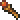

# Changelog

## Meta information

This file documents all notable project changes.

The format is based on [Keep a Changelog](https://keepachangelog.com/en/1.1.0/),  
and this project adheres to [Semantic Versioning](https://semver.org/spec/v2.0.0.html).

## [0.2.0] - 2024-07-??

### Added

- Syntax highlighting for source, event instructions, parameters, text formatters, and constants
  - Includes special rules for key, variable-related, control, block, numbers-only, and typical named instructions
  - Complete list of TextMate rules for insertion into `settings.json`, with community-inspired coloring
- Language support including regions
- Event instruction help upgrades
  - Proper inclusion of tables, and code and pre blocks
  - Numbers-only event instruction support, including:
    - Never used
      - ⛔
      - 
    - No info
      - ⚠️
      - 
- Starting snippet collection, including:
  - Unit and camera setup
  - Messages
  - End battle sequences
  - Constants
  - Regions
- Iconography
  - Event Instruction Upgrade icons
   
  in event instruction help as appropriate
  - Extension icon 
- CHANGELOG.md

### Changed

- Updated README.md:
  - Snippet listing
  - Syntax highlighting scope introduction

## [0.1.0] - 2024-06-02

### Added

- For named event instructions and their parameters:
  - Hover support
  - Code completion including signature snippet
  - Signature help
- Basic README.md
- Configuration for trace logs

## [Planned / Unreleased]

### (to be) Added

- Syntax highlighting for:
  - Key event instructions (`DisplayMessage`)
  - Variables / constants
  - Possibly delimiters?
- Snippets
  - Variables / constants
- Signature help advancement:
  - When initiating in an existing (partial) event instruction call:
    - Initiates "snippet mode" to allow easy tabbing between parameters (keeps current parameter values)
    - Fills in missing snippet pieces
- Event instruction help:
  - Replace HTML trouble characters <,>, etc? Mind embedded XML (might be done?)
  - Links to other event instructions jump to IDE documentation
  - Hover & code completion & signature help for tags
  - List suggested/restricted values on signature help for parameters
  - Include last update timestamp from wiki?
  - Include examples (point to EasyVent folder)
- Formatting help
  - Selected text
  - Whole document
  - While typing
  - On save?
- Event instruction references:
  - Occurrence highlight in code (already effected by VS Code / language support?)
  - Find references
  - Definition file?
- Diagnostics
  - Non-matching parameter types
    - Size (byte vs. half word etc)
    - Signs / prefixes (`x`, `+`, `-`, `r`)
  - Restricted parameter values by event instruction
  - Unclosed blocks
  - Unmatching variable / constant names
- Code actions
  - Convertible parameters:
    - Convert `2t` into 2 tiles' worth of displacement
      - Different depending on X Y Z axis
    - `s` for seconds, `d` for degrees, `v` for view (`ev` would be East view), `p` for percent 
    - `f` for frames?, `h` for hex colors?
- Configurations
  - Signature help
    - Automatic on code completion
    - Snippet completion &/ mode on partial instances
  - Alternative snippets with less help? (risk of redundancy; not sure it's even possible unless dynamically generating the snips)
  - Diagnostic warning / error levels
- Tool integrations?
  - Whatever has CLI

### (to be) Changed

- ?

### (to be) Deprecated

- ?

### (to be) Removed

- ?

### (to be) Fixed

- ?

### (to be) Security

- ?

## This

A little bit